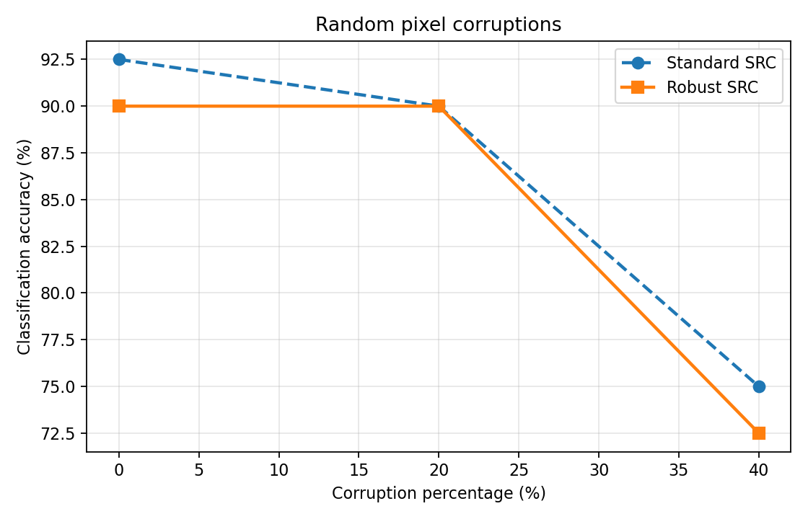
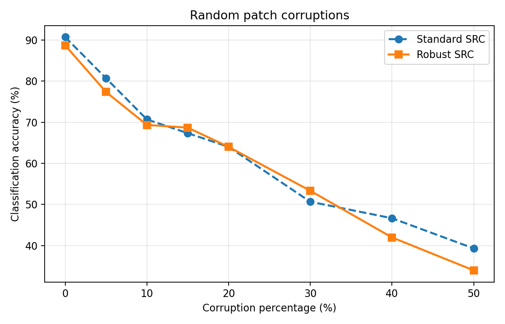
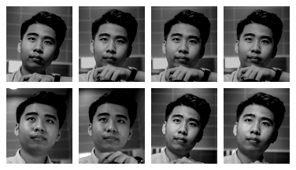
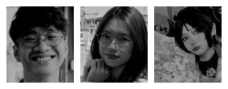

# Assignment 6 Report: Sparse Representation Classification for Face Recognition

**COMP5340 — Spring 2026**

## Abstract

We implement Sparse Representation Classification (SRC) on the cropped Extended Yale Face Database B, extend it to handle sparse pixel/patch corruptions via robust SRC, and evaluate preprocessing plus outlier rejection on personal selfies. On a stratified 50/50 split, baseline SRC achieves **91.12%** accuracy. Robust SRC helps under patch occlusion; a residual-based gate rejects out-of-gallery selfies while accepting an in-database “friend” probe.

---

## Dataset and protocol

| Item | Value |
|------|-------|
| Database | `material/CroppedYale_96_84_2414_subset.mat` |
| Images | 2414 faces, size **96 × 84**, 38 subjects |
| Split | Stratified 50/50 per subject, `seed = 0` |
| Training | 1209 images (dictionary only) |
| Testing | 1205 images (unless noted) |
| Sparse coding | LASSO + ISTA, λ = 0.01 |

**Code:** `assignment_6_src_common.py`, `assignment_6_src_faces.py`, `assignment_6_issue2_robust_outliers.py`, `assignment_6_issue3_selfies.py`

---

## Issue 1: Baseline SRC

### Method

1. Vectorize each face to \(y \in \mathbb{R}^{8064}\); build dictionary \(A\) from training faces (column \(\ell_2\)-normalized).
2. Solve \(\min_\alpha \|\alpha\|_1 + \frac{\lambda}{2}\|y - A\alpha\|_2^2\) (exact \(A\alpha = y\) is infeasible when pixel dimension exceeds training count).
3. Predict \(\arg\min_k \|y - A_k \delta_k(\alpha)\|_2\) (Wright et al., PAMI 2009).

### Results

| Metric | Value |
|--------|------:|
| **Accuracy** | **91.12%** |
| Runtime | 578 s (~0.48 s / image) |

```bash
python Assignment_6/assignment_6_src_faces.py
```

---

## Issue 2: Robust SRC under sparse outliers

### Corruption

- **Random pixels:** fraction \(p\) of entries → uniform noise in \([0,255]\).
- **Random patches:** \(24\times24\) blocks until \(\approx p\) of pixels are corrupted.

### Robust model

\(y = A\alpha + e\) with sparse \(e\):

\[
\min_{\alpha,e}\ \|\alpha\|_1 + \|e\|_1 + \frac{\lambda}{2}\|y - A\alpha - e\|_2^2
\]

Classify from \(\alpha\) using the same SRC residual rule.

### Results





### Observations

- **Pixels:** both methods degrade gradually; performance is similar.
- **Patches:** more harmful; robust SRC can beat standard SRC at moderate \(p\) (explicit \(e\) models localized outliers).
- **High \(p\):** both collapse when corruption dominates the signal.
- Robust SRC is ~4–5× slower per image.

```bash
python Assignment_6/assignment_6_issue2_robust_outliers.py
```

---

## Issue 3: Selfies, outlier rejection, and gallery enrollment

**Data:** `selfy/` (8), `friend_selfies/` (3). New subject ID: **class 39**.

| Phase | What we do | Main result |
|-------|------------|-------------|
| **1** | Yale only; test my selfies | **0/8** as class 39 (forced Yale labels) |
| **2** | Outlier gate | My **8/8** + friend **3/3** rejected |
| **3** | Add 5 train selfies as class 39 | 1214-atom dictionary |
| **4** | Test held-out + friend | My test **3/3** pred. 39 (**2/3** accepted); friend **3/3** rejected |





Full write-up: `assignment_6_issue3_report.md`.

```bash
python Assignment_6/assignment_6_issue3_selfies.py --calibration-max 200
```

---

## LaTeX report

Compile the full report (with figures) from this folder:

```bash
cd Assignment_6
pdflatex assignment_6_report.tex
```

---

## Reference

J. Wright, A. Y. Yang, A. Ganesh, S. S. Sastry, and Y. Ma, “Robust face recognition via sparse representation,” *IEEE TPAMI*, 31(2):210–227, 2009.
